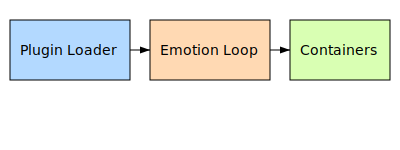

# Architecture 4.5 Overview

SentientOS 4.5 introduces a refactored plugin loader, an explicit affect telemetry loop, and updated container topology. This document summarizes those core pieces of infrastructure.

## Plugin Loader

The plugin loader scans the `gp_plugins` directory for Python modules. Each module exposes a `register` hook that receives the `register_plugin` callback from `plugin_framework.py`. When loaded, plugins are validated for Sanctuary Privilege banners before activation. The loader tracks plugin health and supports dynamic reloads to minimize downtime.

## Affect Telemetry Loop

Affect telemetry travels through a dedicated loop. `voice_loop.py` captures audio, fuses text sentiment with microphone analysis, and feeds bounded tone metadata into the expression memory store. Plugins may react by adjusting avatars or logging mood metrics. The loop ensures every utterance is annotated with an affect vector used for expression shaping only.

## Container Topology

A typical deployment runs multiple containers: one for the core API and plugin manager, another for the voice and affect telemetry services, and optional sidecars for data persistence. Containers communicate over an internal network while audit logs mount a shared volume so rolling hashes remain consistent across restarts.

SentientOS prioritizes operator accountability, auditability, and safe shutdown.
